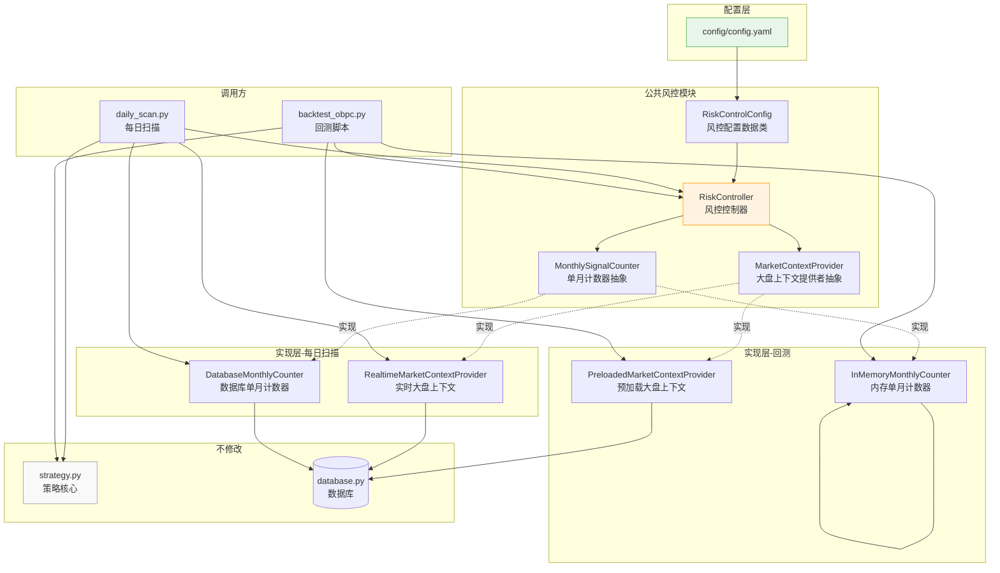
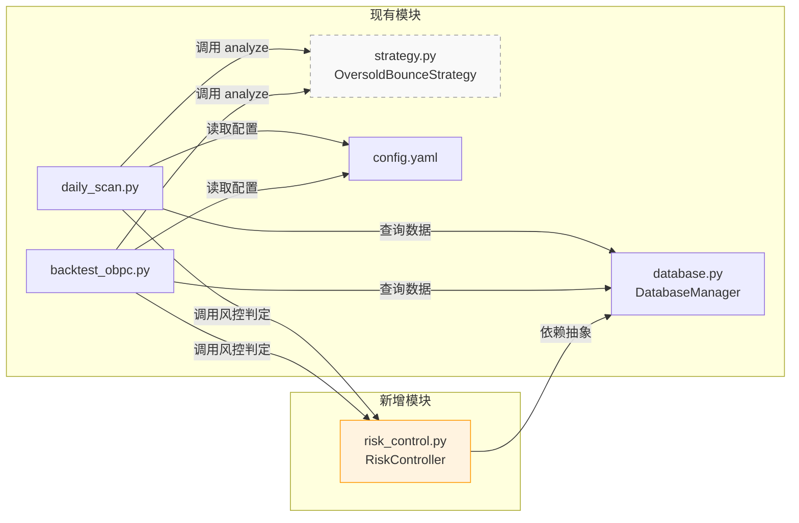
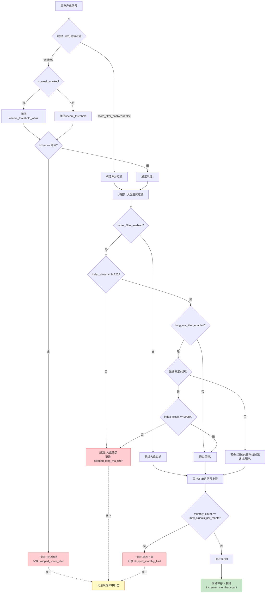
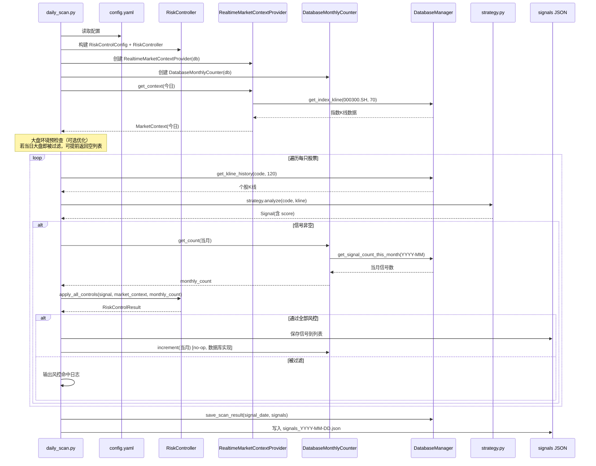
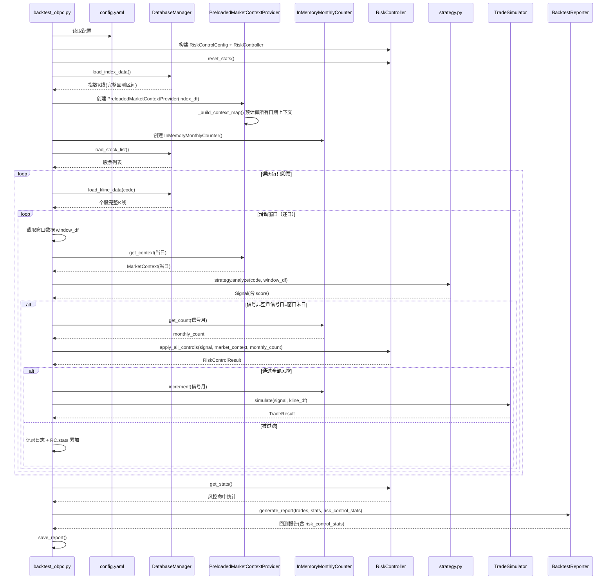
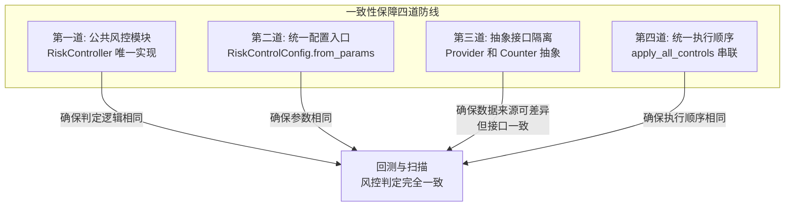

# OBPC 超跌反弹策略风控增强架构设计

## 0. 文档信息

| 项目 | 内容 |
|------|------|
| 文档版本 | V1.1 |
| 创建日期 | 2026-06-23 |
| 作者 | 后端架构师 |
| 审核人 | 待定 |
| 最后更新 | 2026-06-24 |
| 文档状态 | 待评审 |
| 关联需求 | [OBPC策略风控增强需求.md](./OBPC策略风控增强需求.md) |
| 关联代码版本 | strategy v25 / config V3.0 |

### 修改记录

| 版本 | 日期 | 修改人 | 修改内容 |
|------|------|--------|---------|
| V1.0 | 2026-06-23 | 后端架构师 | 初始版本，完成三层风控模块的架构设计 |
| V1.1 | 2026-06-24 | 代码图书馆长 | 同步代码实现：修正风控执行顺序为"评分阈值→大盘趋势→单月上限"；filter_rule 命名统一为 long_ma_filter；score_threshold 代码默认值更新为 60 |

### 术语表

| 术语 | 含义 |
|------|------|
| 风控控制器 | RiskController，统一封装三层风控逻辑的核心类 |
| 大盘上下文 | MarketContext，包含当日大盘指数、均线、弱势标记的环境对象 |
| 单月计数器 | MonthlySignalCounter，统计当月已产出信号数的抽象接口 |
| 上下文提供者 | MarketContextProvider，提供指定日期大盘上下文的抽象接口 |

---

## 1. 设计目标与原则

### 1.1 设计目标

| 目标 | 衡量标准 |
|------|---------|
| 一致性 | 回测与每日扫描使用完全相同的风控判定逻辑，差异仅在数据来源 |
| 可配置 | 三层风控的所有参数通过 `config.yaml` 配置，代码零硬编码 |
| 可扩展 | 新增风控规则无需修改调用方，只需在 RiskController 内增加方法 |
| 可观测 | 风控命中日志统一格式，回测报告含风控命中统计 |
| 低侵入 | 不修改 `strategy.py` 的 `analyze` 方法，风控在扫描层执行 |

### 1.2 设计原则

1. **公共逻辑抽取**：三层风控逻辑集中到一个公共模块，避免在 `daily_scan.py` 和 `backtest_obpc.py` 中重复实现
2. **依赖倒置**：风控控制器依赖抽象接口（上下文提供者、单月计数器），不依赖具体数据来源
3. **单一职责**：风控模块只负责"是否放行"的判定，不负责信号产出和交易模拟
4. **配置驱动**：所有业务阈值从配置读取，代码中不出现 60、12、75 等魔法数字
5. **渐进增强**：新增配置参数均有默认值，旧配置文件可正常运行（向后兼容）

---

## 2. 架构概览

### 2.1 整体架构图



### 2.2 核心设计决策

| 决策点 | 方案 | 理由 |
|--------|------|------|
| 风控模块位置 | `strategy/oversold_bounce/risk_control.py` | 风控逻辑属于策略范畴，与策略同目录便于维护 |
| 是否新建模块 | 新建公共模块 | 避免在两个脚本中重复实现，确保一致性（需求 R-5） |
| 一致性保障策略 | 抽象接口 + 公共控制器 | 风控判定逻辑统一在 RiskController，数据来源通过依赖注入差异化 |
| 单月计数实现 | 抽象基类 + 两种实现 | 每日扫描用数据库查询，回测用内存累计，互不干扰 |
| 大盘上下文构建 | 抽象基类 + 两种实现 | 每日扫描实时查询，回测预加载字典，性能与一致性兼顾 |

---

## 3. 模块设计

### 3.1 模块划分

```
strategy/oversold_bounce/
├── __init__.py
├── strategy.py              # 不修改（策略核心）
└── risk_control.py          # 新增：公共风控模块
    ├── RiskControlConfig    # 风控配置数据类
    ├── MarketContext        # 大盘环境上下文数据类
    ├── RiskControlResult    # 风控检查结果数据类
    ├── RiskController       # 风控控制器（核心）
    ├── MarketContextProvider (ABC)        # 大盘上下文提供者抽象
    ├── RealtimeMarketContextProvider      # 实时实现（每日扫描）
    ├── PreloadedMarketContextProvider     # 预加载实现（回测）
    ├── MonthlySignalCounter (ABC)         # 单月计数器抽象
    ├── DatabaseMonthlyCounter             # 数据库实现（每日扫描）
    └── InMemoryMonthlyCounter             # 内存实现（回测）
```

### 3.2 模块职责

| 模块 | 职责 | 不负责 |
|------|------|--------|
| `RiskController` | 执行三层风控判定，返回放行/过滤结果 | 数据获取、信号产出、交易模拟 |
| `MarketContextProvider` | 提供指定日期的大盘环境上下文 | 风控判定逻辑 |
| `MonthlySignalCounter` | 提供指定月份的已产出信号数 | 风控判定逻辑 |
| `RiskControlConfig` | 封装风控配置参数 | 配置加载（由调用方从 yaml 读取后构建） |

### 3.3 与现有模块的关系



说明：`strategy.py` 用虚线表示不修改；`risk_control.py` 是唯一新增模块。

---

## 4. 接口设计

### 4.1 数据类定义

#### 4.1.1 RiskControlConfig（风控配置）

```python
@dataclass
class RiskControlConfig:
    """风控配置数据类，从 config.yaml 的 strategies.oversold_bounce.params 构建"""

    # ===== 风控1：大盘趋势过滤 =====
    index_filter_enabled: bool = True
    """大盘过滤总开关"""

    index_code: str = "000300.SH"
    """大盘指数代码"""

    index_ma_period: int = 20
    """短周期均线天数（原有）"""

    index_ma_period_long: int = 60
    """长周期均线天数（新增）"""

    long_ma_filter_enabled: bool = True
    """60日均线过滤开关（新增）"""

    # ===== 风控2：单月信号上限 =====
    max_signals_per_month: int = 12
    """单月信号数上限（新增）"""

    # ===== 风控3：动态评分阈值 =====
    score_filter_enabled: bool = True
    """评分过滤总开关（新增）"""

    score_threshold: float = 60
    """默认评分阈值（非弱势市场的基础阈值），确保只有高质量信号进入单月名额竞争（新增）"""

    score_threshold_weak: float = 75
    """弱势市场评分阈值（新增）"""

    weak_market_condition: str = "below_ma60"
    """弱势市场判定条件（新增），目前仅支持 below_ma60"""

    @classmethod
    def from_params(cls, params: Dict) -> "RiskControlConfig":
        """
        从策略参数字典构建风控配置

        Args:
            params: config.yaml 中 strategies.oversold_bounce.params 字典

        Returns:
            RiskControlConfig: 风控配置对象
        """
        index_filter = params.get("index_filter", {})
        score_filter = params.get("score_filter", {})

        return cls(
            index_filter_enabled=index_filter.get("enabled", True),
            index_code=index_filter.get("index_code", "000300.SH"),
            index_ma_period=index_filter.get("index_ma_period", 20),
            index_ma_period_long=index_filter.get("index_ma_period_long", 60),
            long_ma_filter_enabled=index_filter.get("long_ma_filter_enabled", True),
            max_signals_per_month=params.get("max_signals_per_month", 12),
            score_filter_enabled=score_filter.get("enabled", True),
            score_threshold=score_filter.get("score_threshold", 60),
            score_threshold_weak=score_filter.get("score_threshold_weak", 75),
            weak_market_condition=score_filter.get("weak_market_condition", "below_ma60"),
        )
```

#### 4.1.2 MarketContext（大盘环境上下文）

```python
@dataclass
class MarketContext:
    """
    大盘环境上下文

    封装某一交易日的大盘环境信息，供风控控制器使用。
    由 MarketContextProvider 提供。
    """

    current_date: str
    """当前交易日，格式 YYYY-MM-DD"""

    index_close: float
    """大盘指数收盘价"""

    index_ma20: Optional[float] = None
    """大盘20日均线值，数据不足时为 None"""

    index_ma60: Optional[float] = None
    """大盘60日均线值，数据不足时为 None"""

    is_weak_market: bool = False
    """是否弱势市场（沪深300 < MA60）"""

    data_sufficient: bool = True
    """大盘数据是否充足（用于决定是否跳过60日均线过滤）"""

    @property
    def above_ma20(self) -> bool:
        """大盘是否在20日均线上方"""
        if self.index_ma20 is None:
            return True  # 数据不足时放行
        return self.index_close >= self.index_ma20

    @property
    def above_ma60(self) -> bool:
        """大盘是否在60日均线上方"""
        if self.index_ma60 is None:
            return True  # 数据不足时放行
        return self.index_close >= self.index_ma60
```

#### 4.1.3 RiskControlResult（风控检查结果）

```python
@dataclass
class RiskControlResult:
    """
    风控检查结果

    封装三层风控的最终判定结果和详细信息。
    """

    passed: bool
    """是否通过全部风控检查"""

    filter_rule: str = ""
    """被过滤的规则名（passed=True 时为空）：
    - 'long_ma_filter'：大盘趋势过滤
    - 'monthly_limit'：单月信号上限
    - 'score_threshold'：评分阈值过滤
    """

    filter_reason: str = ""
    """过滤原因的中文描述（用于日志输出）"""

    details: Dict = field(default_factory=dict)
    """详细信息（如当前阈值、当月计数、大盘环境等）"""

    effective_threshold: Optional[float] = None
    """当前生效的评分阈值（无论是否被过滤，都记录用于调试）"""
```

### 4.2 核心类：RiskController

```python
class RiskController:
    """
    风控控制器

    封装三层风控判定逻辑，是回测与每日扫描共用的唯一风控入口。
    通过依赖注入接收 MarketContextProvider 和 MonthlySignalCounter，
    确保判定逻辑一致而数据来源可差异化。

    三层风控执行顺序（任一环节过滤即终止后续）：
        1. 动态评分阈值过滤（前置，避免低分信号占用单月名额）
        2. 大盘趋势过滤（20日 + 60日均线）
        3. 单月信号数量上限检查
    """

    def __init__(self, config: RiskControlConfig):
        """
        初始化风控控制器

        Args:
            config: 风控配置
        """
        self.config = config

        # 风控命中统计计数器（用于回测报告）
        self.stats = {
            "skipped_long_ma_filter": 0,    # 被60日均线过滤的信号数
            "skipped_monthly_limit": 0,     # 被单月上限过滤的信号数
            "skipped_score_filter": 0,      # 被评分阈值过滤的信号数
        }

        # 按月份统计风控命中（用于回测报告的时间分布分析）
        self.monthly_filter_stats: Dict[str, Dict[str, int]] = {}

    def apply_all_controls(
        self,
        signal,
        market_context: MarketContext,
        monthly_count: int,
    ) -> RiskControlResult:
        """
        应用全部三层风控检查（串联执行）

        执行顺序：动态评分阈值 → 大盘趋势过滤 → 单月信号上限
        任一环节过滤即终止后续检查。

        调整说明：
            评分阈值前置，确保低分信号先被过滤，不会占用单月名额，
            避免高分信号因单月上限已满而被过滤（先到先得问题）。

        Args:
            signal: 策略产出的信号对象（需有 signal_date 和 score 属性）
            market_context: 当日大盘环境上下文
            monthly_count: 当月已产出的信号数（调用前由计数器提供）

        Returns:
            RiskControlResult: 风控检查结果
        """

    def check_market_trend(
        self, market_context: MarketContext
    ) -> RiskControlResult:
        """
        风控2：大盘趋势过滤

        业务规则：
            - BR-1.2: index_close >= MA20 且 index_close >= MA60 时放行
            - BR-1.3: 任一条件不满足时过滤
            - BR-1.4: 60日均线过滤可独立开关
            - BR-1.5: 数据不足60天时跳过60日均线过滤并警告

        Args:
            market_context: 大盘环境上下文

        Returns:
            RiskControlResult: 检查结果
        """

    def check_monthly_limit(
        self, signal_date: str, monthly_count: int
    ) -> RiskControlResult:
        """
        风控3：单月信号数量上限检查

        业务规则：
            - BR-2.1: 上限由 max_signals_per_month 配置，默认12
            - BR-2.2: 以 signal_date 所在自然月为统计单位
            - BR-2.3: 达到上限后过滤并记录日志

        Args:
            signal_date: 信号日期（回踩确认日），格式 YYYY-MM-DD
            monthly_count: 当月已产出信号数

        Returns:
            RiskControlResult: 检查结果
        """

    def check_score_threshold(
        self, score: float, market_context: MarketContext
    ) -> RiskControlResult:
        """
        风控1：动态评分阈值过滤（前置，避免低分信号占用单月名额）

        业务规则：
            - BR-3.1: 默认阈值 score_threshold，0 表示不过滤
            - BR-3.2: 弱势市场阈值 score_threshold_weak
            - BR-3.3: 弱势市场判定：沪深300 < MA60
            - BR-3.4: 评分 < 当前生效阈值时过滤

        Args:
            score: 信号评分
            market_context: 大盘环境上下文（用于判断是否弱势市场）

        Returns:
            RiskControlResult: 检查结果
        """

    def is_weak_market(self, market_context: MarketContext) -> bool:
        """
        判断是否弱势市场

        根据 weak_market_condition 配置判定：
            - 'below_ma60': 沪深300收盘价 < MA60

        Args:
            market_context: 大盘环境上下文

        Returns:
            bool: True 表示弱势市场
        """

    def get_effective_threshold(
        self, market_context: MarketContext
    ) -> float:
        """
        获取当前生效的评分阈值

        弱势市场返回 score_threshold_weak，否则返回 score_threshold

        Args:
            market_context: 大盘环境上下文

        Returns:
            float: 当前生效的评分阈值
        """

    def get_stats(self) -> Dict:
        """获取风控命中统计（用于回测报告）"""

    def reset_stats(self) -> None:
        """重置统计计数器（回测开始前调用）"""
```

### 4.3 抽象接口：MarketContextProvider

```python
class MarketContextProvider(ABC):
    """
    大盘环境上下文提供者抽象基类

    职责：提供指定交易日的大盘环境上下文。
    两种实现：
        - RealtimeMarketContextProvider：每日扫描实时查询数据库
        - PreloadedMarketContextProvider：回测预加载指数数据构建字典
    """

    @abstractmethod
    def get_context(self, date_str: str) -> Optional[MarketContext]:
        """
        获取指定日期的大盘环境上下文

        Args:
            date_str: 日期字符串，格式 YYYY-MM-DD

        Returns:
            Optional[MarketContext]: 大盘上下文，日期不存在时返回 None
        """
        raise NotImplementedError
```

#### 4.3.1 RealtimeMarketContextProvider（每日扫描用）

```python
class RealtimeMarketContextProvider(MarketContextProvider):
    """
    实时大盘环境上下文提供者

    用于每日扫描场景：每次调用都从数据库获取最新指数数据并计算均线。
    适用于单次扫描只关心"当日"大盘环境的场景。
    """

    def __init__(self, db: DatabaseManager, config: RiskControlConfig):
        """
        Args:
            db: 数据库管理器
            config: 风控配置
        """
        self.db = db
        self.config = config

    def get_context(self, date_str: str) -> Optional[MarketContext]:
        """
        实时获取大盘上下文

        实现要点：
            1. 从数据库获取指数 K 线（取最近 max(ma_period_long+10, 30) 天）
            2. 计算 MA20 和 MA60
            3. 数据不足60天时，index_ma60=None，data_sufficient=False
            4. 判断 is_weak_market
        """

    def _calculate_ma(self, index_df: pd.DataFrame, period: int) -> Optional[float]:
        """计算指定周期的均线值"""
```

#### 4.3.2 PreloadedMarketContextProvider（回测用）

```python
class PreloadedMarketContextProvider(MarketContextProvider):
    """
    预加载大盘环境上下文提供者

    用于回测场景：启动时一次性加载全部指数数据，预计算所有日期的上下文，
    构建日期到上下文的映射字典，查询时 O(1)。
    """

    def __init__(
        self,
        index_df: pd.DataFrame,
        config: RiskControlConfig,
    ):
        """
        Args:
            index_df: 完整的指数 K 线数据（回测区间内）
            config: 风控配置
        """
        self.config = config
        self.context_map: Dict[str, MarketContext] = {}
        self._build_context_map(index_df)

    def _build_context_map(self, index_df: pd.DataFrame) -> None:
        """
        预计算所有日期的大盘上下文

        实现要点：
            1. 计算 MA20 和 MA60 列
            2. 遍历每个交易日，构建 MarketContext
            3. 前60天 index_ma60=None（数据不足）
            4. 存入 context_map 字典
        """

    def get_context(self, date_str: str) -> Optional[MarketContext]:
        """从预构建的字典中获取上下文"""
        return self.context_map.get(date_str)
```

### 4.4 抽象接口：MonthlySignalCounter

```python
class MonthlySignalCounter(ABC):
    """
    单月信号计数器抽象基类

    职责：提供指定月份的已产出信号数，并在新信号产出时增加计数。
    两种实现：
        - DatabaseMonthlyCounter：每日扫描查询数据库 scan_results 表
        - InMemoryMonthlyCounter：回测在内存中累计计数
    """

    @abstractmethod
    def get_count(self, year_month: str) -> int:
        """
        获取指定月份的已产出信号数

        Args:
            year_month: 月份字符串，格式 YYYY-MM

        Returns:
            int: 信号数
        """
        raise NotImplementedError

    @abstractmethod
    def increment(self, year_month: str) -> None:
        """
        增加指定月份的信号计数

        在信号通过全部风控检查并确认产出后调用。

        Args:
            year_month: 月份字符串，格式 YYYY-MM
        """
        raise NotImplementedError
```

#### 4.4.1 DatabaseMonthlyCounter（每日扫描用）

```python
class DatabaseMonthlyCounter(MonthlySignalCounter):
    """
    基于数据库的单月信号计数器

    用于每日扫描场景：通过查询 scan_results 表统计当月已推送信号数。
    信号产出后由 daily_scan.py 的 save_scan_result 写入数据库，
    下次扫描时自动计入计数。
    """

    def __init__(self, db: DatabaseManager):
        """
        Args:
            db: 数据库管理器
        """
        self.db = db

    def get_count(self, year_month: str) -> int:
        """
        查询数据库获取当月信号数

        实现要点：
            调用 db.get_signal_count_this_month(year_month)
            （需在 database.py 新增此方法）
        """

    def increment(self, year_month: str) -> None:
        """
        数据库实现下，计数由 save_scan_result 自动完成，无需主动 increment

        此方法为空实现（no-op），保留接口一致性。
        """
        # 数据库实现下，信号保存即计数，无需主动 increment
        pass
```

#### 4.4.2 InMemoryMonthlyCounter（回测用）

```python
class InMemoryMonthlyCounter(MonthlySignalCounter):
    """
    基于内存的单月信号计数器

    用于回测场景：在内存中维护月份到计数的字典，
    信号产出后主动 increment，确保回测时间序列内计数准确。
    """

    def __init__(self):
        self.counts: Dict[str, int] = {}

    def get_count(self, year_month: str) -> int:
        return self.counts.get(year_month, 0)

    def increment(self, year_month: str) -> None:
        self.counts[year_month] = self.counts.get(year_month, 0) + 1
```

---

## 5. 数据流设计

### 5.1 三层风控执行顺序



### 5.2 每日扫描数据流



### 5.3 回测数据流



### 5.4 两个场景的差异对照

| 维度 | 每日扫描 | 回测 |
|------|---------|------|
| 大盘上下文来源 | RealtimeMarketContextProvider（实时查库） | PreloadedMarketContextProvider（预加载字典） |
| 单月计数来源 | DatabaseMonthlyCounter（查 scan_results 表） | InMemoryMonthlyCounter（内存累计） |
| 计数 increment | no-op（保存信号即入库，下次查询自动计数） | 主动 increment（内存字典累加） |
| 大盘预检查 | 支持（当日大盘不佳可提前返回空列表） | 不支持（必须逐日逐股票遍历） |
| 风控判定逻辑 | **完全相同**（都调用 RiskController.apply_all_controls） | **完全相同** |
| 风控执行顺序 | **完全相同**（评分→大盘→单月） | **完全相同** |
| 配置参数 | **完全相同**（都从 config.yaml 读取） | **完全相同** |

---

## 6. 配置设计

### 6.1 新增配置项结构

在 `config/config.yaml` 的 `strategies.oversold_bounce.params` 下新增以下配置：

```yaml
strategies:
  oversold_bounce:
    params:
      # ===== 原有配置（保持不变） =====
      # ... 大跌检测、缩量检测、放量检测、回踩确认、流动性、交易参数等 ...

      # ===== 大盘环境过滤（增强） =====
      index_filter:
        enabled: true                    # 大盘过滤总开关（原有）
        index_code: "000300.SH"          # 指数代码（原有）
        index_ma_period: 20              # 短周期均线（原有）
        index_ma_period_long: 60         # 长周期均线（新增）
        long_ma_filter_enabled: true     # 60日均线过滤开关（新增）

      # ===== 信号间隔控制 =====
      signal_cooldown_days: 60           # 信号冷却期（原有）
      max_signals_per_year: 2            # 单股票年度限制（原有）
      max_signals_per_month: 12          # 单月信号数上限（新增）

      # ===== 评分阈值过滤（新增整段） =====
      score_filter:
        enabled: true                    # 评分过滤总开关
        score_threshold: 60              # 默认评分阈值（非弱势市场的基础阈值）
        score_threshold_weak: 75         # 弱势市场评分阈值
        weak_market_condition: "below_ma60"  # 弱势市场判定条件
```

### 6.2 配置参数说明

| 参数路径 | 类型 | 默认值 | 说明 | 对应需求 |
|---------|------|--------|------|---------|
| `index_filter.index_ma_period_long` | int | 60 | 长周期均线天数 | FR-1 |
| `index_filter.long_ma_filter_enabled` | bool | true | 60日均线过滤开关 | FR-1 |
| `max_signals_per_month` | int | 12 | 单月信号数上限 | FR-2 |
| `score_filter.enabled` | bool | true | 评分过滤总开关 | FR-3 |
| `score_filter.score_threshold` | float | 60 | 默认评分阈值（非弱势市场的基础阈值） | FR-3 |
| `score_filter.score_threshold_weak` | float | 75 | 弱势市场评分阈值 | FR-3 |
| `score_filter.weak_market_condition` | str | "below_ma60" | 弱势市场判定条件 | FR-3 |

### 6.3 配置加载流程


### 6.4 向后兼容性

| 场景 | 行为 |
|------|------|
| 旧配置文件（无新增参数） | `RiskControlConfig.from_params` 使用默认值，输出警告日志 |
| 新增参数部分缺失 | 缺失项使用默认值，输出警告日志 |
| 配置参数类型错误 | 加载时报错，提示具体参数名 |
| 配置参数值为 null | 视为缺失，使用默认值 |

---

## 7. 数据库扩展设计

### 7.1 新增方法

在 `data/database.py` 的 `DatabaseManager` 类中新增以下方法：

```python
def get_signal_count_this_month(self, year_month: str) -> int:
    """
    获取指定月份的所有股票信号总数（用于单月信号上限检查）

    与现有 get_signal_count_this_year 不同：
        - get_signal_count_this_year: 按单股票查询年度信号数
        - get_signal_count_this_month: 查询全市场当月信号总数

    Args:
        year_month: 月份字符串，格式 YYYY-MM

    Returns:
        int: 当月信号总数

    实现要点：
        SELECT COUNT(*) FROM scan_results
        WHERE TO_CHAR(scan_date, 'YYYY-MM') = %s
    """
```

### 7.2 表结构影响

| 表 | 是否修改 | 说明 |
|----|---------|------|
| `scan_results` | 不修改 | 复用现有 scan_date 字段进行月份统计 |
| `klines` | 不修改 | 复用现有 code+frequency+date 查询指数数据 |
| `stocks` | 不修改 | 无关 |
| `positions` | 不修改 | 无关 |
| `push_history` | 不修改 | 无关 |

### 7.3 查询性能考量

`get_signal_count_this_month` 查询利用现有的 `idx_scan_date` 索引，单次查询耗时 < 10ms，对每日扫描性能影响可忽略。

---

## 8. 回测报告扩展设计

### 8.1 新增报告字段

在回测报告 JSON 中新增 `risk_control_stats` 字段：

```json
{
  "meta": { ... },
  "summary": { ... },
  "exit_reasons": { ... },
  "yearly_stats": [ ... ],
  "stats": {
    "total_stocks": 0,
    "total_signals": 0,
    "skipped_cooldown": 0,
    "skipped_index_filter": 0,
    "skipped_long_ma_filter": 0,
    "skipped_monthly_limit": 0,
    "skipped_score_filter": 0,
    "total_trades": 0,
    "failed_trades": 0
  },
  "risk_control_stats": {
    "summary": {
      "skipped_long_ma_filter": 0,
      "skipped_monthly_limit": 0,
      "skipped_score_filter": 0,
      "total_filtered": 0
    },
    "monthly": [
      {
        "year_month": "2026-02",
        "long_ma_filter": 0,
        "monthly_limit": 0,
        "score_filter": 0,
        "total_filtered": 0
      }
    ]
  },
  "trades": [ ... ]
}
```

### 8.2 BacktestReporter 扩展

`BacktestReporter.generate_report` 方法签名调整：

```python
def generate_report(
    self,
    trades: List[TradeResult],
    stats: Dict,
    risk_control_stats: Optional[Dict] = None,  # 新增参数
) -> Dict:
    """
    生成回测报告

    Args:
        trades: 交易结果列表
        stats: 回测引擎统计信息
        risk_control_stats: 风控命中统计（新增，可选）
            {
                'summary': {...},
                'monthly': [...]
            }
    """
```

### 8.3 BacktestEngine 扩展

`BacktestEngine` 新增成员：

```python
class BacktestEngine:
    def __init__(self, ...):
        # ... 原有成员 ...
        self.risk_controller: Optional[RiskController] = None  # 新增
        self.market_context_provider: Optional[MarketContextProvider] = None  # 新增
        self.monthly_counter: Optional[MonthlySignalCounter] = None  # 新增
```

`_backtest_single_stock` 方法在调用 `strategy.analyze` 后、调用 `trade_simulator.simulate` 前，插入风控检查逻辑。

---

## 9. 回测与扫描一致性保障

### 9.1 一致性保障机制



### 9.2 一致性检查清单

| 检查项 | 检查方法 | 责任方 |
|--------|---------|--------|
| 风控判定逻辑一致 | 代码审查：daily_scan 和 backtest 都调用 `RiskController.apply_all_controls` | 代码审查员 |
| 配置参数一致 | 两者都从同一 config.yaml 的同一配置段读取 | 配置管理员 |
| 执行顺序一致 | `apply_all_controls` 内部固定顺序：评分→大盘→单月 | 架构师 |
| 大盘上下文构建一致 | 两种 Provider 构建的 MarketContext 字段含义一致 | 架构师 |
| 单月计数语义一致 | 两种 Counter 的 get_count 返回值语义一致（当月已产出信号数） | 架构师 |
| 日志格式一致 | 风控命中日志使用统一模板 | 代码审查员 |

### 9.3 一致性验证方案

建议在实施阶段增加单元测试验证一致性：

```python
# 伪代码：一致性验证测试
def test_risk_control_consistency():
    """验证回测与扫描的风控判定结果一致"""

    # 构造相同的输入
    config = RiskControlConfig(...)
    controller = RiskController(config)

    signal = MockSignal(score=80, signal_date="2026-02-15")
    market_context = MarketContext(
        current_date="2026-02-15",
        index_close=3500,
        index_ma20=3600,  # 低于MA20
        index_ma60=3700,  # 低于MA60
        is_weak_market=True,
    )

    # 模拟每日扫描场景
    result_scan = controller.apply_all_controls(signal, market_context, monthly_count=5)

    # 模拟回测场景（同样的输入）
    result_backtest = controller.apply_all_controls(signal, market_context, monthly_count=5)

    # 验证结果一致
    assert result_scan.passed == result_backtest.passed
    assert result_scan.filter_rule == result_backtest.filter_rule
```

---

## 10. 改动影响范围

### 10.1 文件改动清单

| 文件 | 改动类型 | 改动内容 | 工作量 |
|------|---------|---------|--------|
| `strategy/oversold_bounce/risk_control.py` | **新增** | 公共风控模块（全部类和接口） | 大 |
| `config/config.yaml` | 修改 | 新增 7 个配置参数 | 小 |
| `scripts/daily_scan.py` | 修改 | 接入 RiskController，替换原有大盘过滤逻辑 | 中 |
| `scripts/backtest_obpc.py` | 修改 | 接入 RiskController，扩展报告字段 | 中 |
| `data/database.py` | 修改 | 新增 `get_signal_count_this_month` 方法 | 小 |
| `strategy/oversold_bounce/strategy.py` | **不修改** | 策略核心保持不变 | - |

### 10.2 daily_scan.py 改动详情

| 位置 | 改动内容 |
|------|---------|
| 顶部导入 | 新增 `from strategy.oversold_bounce.risk_control import ...` |
| 第 91-112 行（大盘过滤） | 替换为：构建 RiskController + RealtimeMarketContextProvider + DatabaseMonthlyCounter，调用 `apply_all_controls` |
| 第 152-168 行（冷却期和年度限制） | 保留原有逻辑，在年度限制检查后增加单月上限检查（由 RiskController 统一处理） |
| 信号产出后（第 170-200 行） | 在构建 entry 前调用 `apply_all_controls`，被过滤则 continue |
| 风控命中日志 | 统一使用 RiskControlResult.filter_reason 输出 |

### 10.3 backtest_obpc.py 改动详情

| 位置 | 改动内容 |
|------|---------|
| `BacktestConfig` 数据类 | 新增 `risk_control_config: RiskControlConfig` 字段 |
| `load_backtest_config` 函数 | 构建 RiskControlConfig 并注入 BacktestConfig |
| `BacktestDataLoader.build_index_ma_filter` | 重构为构建 `PreloadedMarketContextProvider`（保留旧方法兼容） |
| `BacktestEngine.__init__` | 新增 risk_controller、market_context_provider、monthly_counter 成员 |
| `BacktestEngine._backtest_single_stock` | 在 `strategy.analyze` 后插入风控检查 |
| `BacktestEngine.run` | 初始化风控控制器和计数器 |
| `BacktestReporter.generate_report` | 新增 risk_control_stats 参数和字段 |
| `BacktestReporter.print_report` | 新增风控统计打印段落 |
| 多进程 worker 初始化 | 传递风控控制器到子进程 |

### 10.4 不改动的部分

| 模块 | 不改动原因 |
|------|-----------|
| `strategy/oversold_bounce/strategy.py` | 需求明确要求不修改 analyze 方法，风控在扫描层实现 |
| 数据库表结构 | 复用现有 scan_results 表，无需新增表 |
| Dockerfile / 部署脚本 | 无新增依赖，无新增容器 |
| 现有配置参数 | 新增参数有默认值，旧参数保持不变 |

---

## 11. 风险与应对

### 11.1 技术风险

| 风险编号 | 风险描述 | 概率 | 影响 | 应对措施 |
|---------|---------|------|------|---------|
| TR-1 | 多进程回测下 InMemoryMonthlyCounter 无法跨进程共享计数 | 高 | 高 | 采用主进程预分配或按股票分片，每片独立计数器；或回测时禁用多进程改单进程 |
| TR-2 | PreloadedMarketContextProvider 预计算内存占用过大 | 低 | 低 | 回测区间6年约 1500 个交易日，每个 MarketContext < 1KB，总内存 < 2MB |
| TR-3 | RealtimeMarketContextProvider 每次查库性能开销 | 中 | 中 | 每日扫描只调用一次（当日大盘），开销可忽略；可增加缓存优化 |

### 11.2 业务风险

| 风险编号 | 风险描述 | 概率 | 影响 | 应对措施 |
|---------|---------|------|------|---------|
| BR-1 | 三层风控叠加后信号数过少（< 20） | 中 | 高 | 回测验证总信号数，必要时调整 max_signals_per_month 和 score_threshold_weak |
| BR-2 | 单月上限在多进程回测下计数不准 | 高 | 高 | 见 TR-1，回测时改单进程或按月份预分配股票 |
| BR-3 | 弱势市场判定过于简单（仅 MA60） | 低 | 中 | 当前需求仅要求 MA60，后续迭代可扩展波动率等指标 |

### 11.3 多进程回测的特殊处理

由于 `backtest_obpc.py` 使用多进程并行回测，而 `InMemoryMonthlyCounter` 无法跨进程共享状态，需特殊处理：

**方案 A（推荐）：单进程回测风控**

```python
# 回测时若启用风控，强制单进程
if config.risk_control_config.score_filter_enabled or \
   config.risk_control_config.long_ma_filter_enabled or \
   config.max_signals_per_month < 999:
    workers = 1
    logger.warning("启用风控规则，回测切换为单进程以确保单月计数准确")
```

**方案 B：两阶段回测**

1. 第一阶段：多进程跑完所有股票，收集全部信号（不应用单月上限）
2. 第二阶段：单进程按时间序列应用单月上限和评分阈值

方案 A 实现简单，方案 B 性能更好但复杂度高。建议优先采用方案 A，若性能不达标再考虑方案 B。

---

## 12. 实施计划

### 12.1 实施阶段划分

| 阶段 | 内容 | 依赖 | 预计工作量 |
|------|------|------|-----------|
| 阶段1 | 实现 `risk_control.py` 公共模块 | 无 | 2 天 |
| 阶段2 | 修改 `config.yaml` 新增配置参数 | 无 | 0.5 天 |
| 阶段3 | 修改 `database.py` 新增查询方法 | 无 | 0.5 天 |
| 阶段4 | 修改 `daily_scan.py` 接入风控 | 阶段1、2、3 | 1 天 |
| 阶段5 | 修改 `backtest_obpc.py` 接入风控 | 阶段1、2 | 1.5 天 |
| 阶段6 | 单元测试（含一致性验证） | 阶段1-5 | 1 天 |
| 阶段7 | 全量回测验证 | 阶段6 | 0.5 天 |
| 阶段8 | 参数调优（如需要） | 阶段7 | 1 天 |

### 12.2 验收检查点

| 检查点 | 验收内容 | 对应需求 |
|--------|---------|---------|
| CP-1 | risk_control.py 单元测试通过 | FR-1/2/3/4 |
| CP-2 | config.yaml 新增参数加载正常，旧配置兼容 | FR-4、AC-4.2 |
| CP-3 | daily_scan.py 风控日志输出正确 | FR-6、AC-6.1 |
| CP-4 | backtest_obpc.py 报告含 risk_control_stats | FR-5/7、AC-5.1/7.1 |
| CP-5 | 全量回测：2026年1-3月信号数 ≤ 15 | AC-5.2 |
| CP-6 | 全量回测：整体胜率 ≥ 60% | AC-5.3 |
| CP-7 | 全量回测：平均收益 ≥ 2% | AC-5.4 |
| CP-8 | 全量回测：硬止损占比 ≤ 20% | AC-5.5 |
| CP-9 | 代码审查无硬编码 | AC-4.1 |

---

## 13. 附录

### 13.1 风控命中日志格式

统一日志格式（满足 FR-6、AC-6.2）：

```
[风控过滤] code={code} name={name} rule={filter_rule} reason={filter_reason} score={score} signal_date={signal_date} details={details}
```

示例输出：

```
[风控过滤] code=600519 name=贵州茅台 rule=long_ma_filter reason=大盘环境不佳（60日均线过滤：沪深300 3500.00 < MA60 3700.00） score=82.50 signal_date=2026-02-15 details={'index_close': 3500.0, 'index_ma60': 3700.0}
[风控过滤] code=000858 name=五粮液 rule=monthly_limit reason=本月信号数已达上限 12 个，停止产生新信号 score=78.30 signal_date=2026-02-20 details={'year_month': '2026-02', 'current_count': 12, 'max_limit': 12}
[风控过滤] code=002594 name=比亚迪 rule=score_threshold reason=信号评分 68.50 低于阈值 75，过滤 score=68.50 signal_date=2026-02-18 details={'effective_threshold': 75, 'is_weak_market': True}
```

### 13.2 相关文件索引

| 文件 | 路径 | 说明 |
|------|------|------|
| 需求文档 | [OBPC策略风控增强需求.md](./OBPC策略风控增强需求.md) | 本次架构设计的需求来源 |
| 策略核心 | [strategy.py](file:///Users/yl/vscode/stockfilter_v3/strategy/oversold_bounce/strategy.py) | 不修改的策略核心 |
| 每日扫描 | [daily_scan.py](file:///Users/yl/vscode/stockfilter_v3/scripts/daily_scan.py) | 待修改的扫描脚本 |
| 回测脚本 | [backtest_obpc.py](file:///Users/yl/vscode/stockfilter_v3/scripts/backtest_obpc.py) | 待修改的回测脚本 |
| 配置文件 | [config.yaml](file:///Users/yl/vscode/stockfilter_v3/config/config.yaml) | 待新增配置参数 |
| 数据库管理 | [database.py](file:///Users/yl/vscode/stockfilter_v3/data/database.py) | 待新增查询方法 |
| 策略说明 | [OBPC策略说明文档.md](./OBPC策略说明文档.md) | 待更新风控章节 |
| 配置管理设计 | [配置管理设计.md](./配置管理设计.md) | 待更新配置说明 |

### 13.3 关键代码位置参考

| 功能 | 文件 | 行号 | 说明 |
|------|------|------|------|
| 当前大盘过滤（每日扫描） | `scripts/daily_scan.py` | L91-L112 | 待替换为 RiskController 调用 |
| 当前大盘过滤构建（回测） | `scripts/backtest_obpc.py` | L352-L381 | `build_index_ma_filter` 待重构 |
| 当前大盘过滤应用（回测） | `scripts/backtest_obpc.py` | L709-L714 | 待替换为 RiskController 调用 |
| 信号冷却期检查 | `scripts/daily_scan.py` | L152-L162 | 保留原有逻辑 |
| 年度信号限制 | `scripts/daily_scan.py` | L164-L168 | 保留原有逻辑 |
| 评分系统 | `strategy/oversold_bounce/strategy.py` | L373-L447 | 不修改 |
| 回测统计计数器 | `scripts/backtest_obpc.py` | L596-L607 | 待扩展风控统计字段 |
| 数据库信号查询 | `data/database.py` | L448-L459 | `get_signal_count_this_year` 参考实现 |

---

**最后更新：** 2026-06-24
